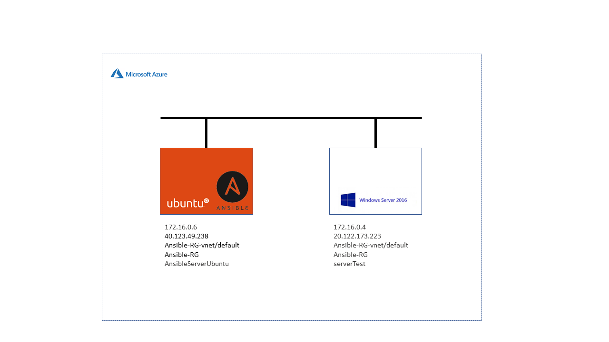

## Windows

  - Build a Windows server (you can download predeployed windows 2016 ova from here: http://tinyurl.com/sol9vhc)

  

  Install Ansible using the official documentation : [Ubuntu Ansible Install](https://docs.ansible.com/ansible/latest/installation_guide/intro_installation.html#installing-ansible-on-ubuntu)
  
  On Windows Server run the commands below (PowerShell)
  

```
  $url = "https://raw.githubusercontent.com/jborean93/ansible-windows/master/scripts/Upgrade-PowerShell.ps1"
  $file = "$env:temp\Upgrade-PowerShell.ps1"
  $username = "ansible"
  $password = "Bia95Dan3267"
  (New-Object -TypeName System.Net.WebClient).DownloadFile($url, $file)
  Set-ExecutionPolicy -ExecutionPolicy Unrestricted -Force
  &$file -Version 5.1 -Username $username -Password $password -Verbose

  [Net.ServicePointManager]::SecurityProtocol = [Net.SecurityProtocolType]::Tls, [Net.SecurityProtocolType]::Tls11, [Net.SecurityProtocolType]::Tls12,          [Net.SecurityProtocolType]::Ssl3
  [Net.ServicePointManager]::SecurityProtocol = "Tls, Tls11, Tls12, Ssl3"

  $reg_winlogon_path = "HKLM:\Software\Microsoft\Windows NT\CurrentVersion\Winlogon"
  Set-ItemProperty -Path $reg_winlogon_path -Name AutoAdminLogon -Value 0
  Remove-ItemProperty -Path $reg_winlogon_path -Name DefaultUserName -ErrorAction SilentlyContinue
  Remove-ItemProperty -Path $reg_winlogon_path -Name DefaultPassword -ErrorAction SilentlyContinue

  $url = "https://raw.githubusercontent.com/ansible/ansible/devel/examples/scripts/ConfigureRemotingForAnsible.ps1"
  $file = "$env:temp\ConfigureRemotingForAnsible.ps1"
  (New-Object -TypeName System.Net.WebClient).DownloadFile($url, $file)
  powershell.exe -ExecutionPolicy ByPass -File $file
  winrm enumerate winrm/config/Listener

  winrm set winrm/config/service '@{AllowUnencrypted="true"}'

  winrm set winrm/config/service/auth '@{Basic="true"}'
```

  - Write Ansible playbook to execute the following, and upload it to your git repo:
      * Install IIS and create a site which serves HTML page with "Hello World"
      * Create a self-signed certificate and bind it to the site you created in the previous bullet on port 443
      * Install dns service and create new zone(you can choose any domain name that you want)
  - Add a record to point the local web server you created, also make sure to create a record to perform dns reverse lookup
  - Add a small exe file or a an image to the web site you created and download it via HTTP(not via HTTPS). Record(sniff) the download session into a pcap file.
  - Filter the download session from the pcap file and create a screenshot, describe the communication steps steps in the session
