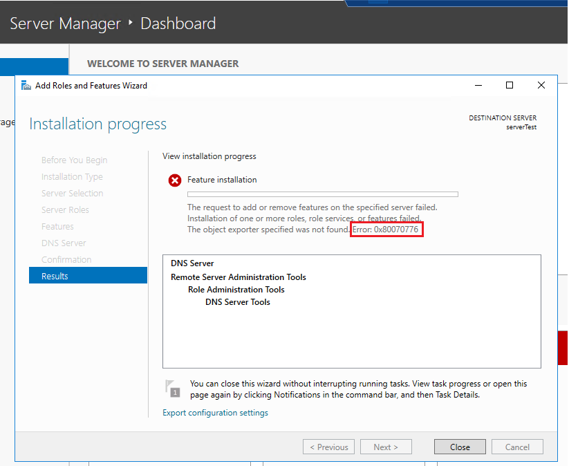

## Windows

  - Build a Windows server (you can download predeployed windows 2016 ova from here: http://tinyurl.com/sol9vhc)

  

  Install Ansible using the official documentation : [Ubuntu Ansible Install](https://docs.ansible.com/ansible/latest/installation_guide/intro_installation.html#installing-ansible-on-ubuntu)
  
  Create ansible user on windows and set to admin group
  
  
  
  
  
  On Windows Server run the commands below (PowerShell)
  

```
  $url = "https://raw.githubusercontent.com/jborean93/ansible-windows/master/scripts/Upgrade-PowerShell.ps1"
  $file = "$env:temp\Upgrade-PowerShell.ps1"
  $username = "ansible"
  $password = "XXXXXXXX"
  (New-Object -TypeName System.Net.WebClient).DownloadFile($url, $file)
  Set-ExecutionPolicy -ExecutionPolicy Unrestricted -Force
  &$file -Version 5.1 -Username $username -Password $password -Verbose

  [Net.ServicePointManager]::SecurityProtocol = [Net.SecurityProtocolType]::Tls, [Net.SecurityProtocolType]::Tls11, [Net.SecurityProtocolType]::Tls12,          [Net.SecurityProtocolType]::Ssl3
  [Net.ServicePointManager]::SecurityProtocol = "Tls, Tls11, Tls12, Ssl3"

  $reg_winlogon_path = "HKLM:\Software\Microsoft\Windows NT\CurrentVersion\Winlogon"
  Set-ItemProperty -Path $reg_winlogon_path -Name AutoAdminLogon -Value 0
  Remove-ItemProperty -Path $reg_winlogon_path -Name DefaultUserName -ErrorAction SilentlyContinue
  Remove-ItemProperty -Path $reg_winlogon_path -Name DefaultPassword -ErrorAction SilentlyContinue

  $url = "https://raw.githubusercontent.com/ansible/ansible/devel/examples/scripts/ConfigureRemotingForAnsible.ps1"
  $file = "$env:temp\ConfigureRemotingForAnsible.ps1"
  (New-Object -TypeName System.Net.WebClient).DownloadFile($url, $file)
  powershell.exe -ExecutionPolicy ByPass -File $file
  winrm enumerate winrm/config/Listener

  winrm set winrm/config/service '@{AllowUnencrypted="true"}'

  winrm set winrm/config/service/auth '@{Basic="true"}'
```

   And test the connection
  
  

  - Write Ansible playbook to execute the following, and upload it to your git repo:
      * Install IIS and create a site which serves HTML page with "Hello World"
      
```
      ---
      - name: Install IIS
      hosts: windows
      gather_facts: true
      tasks:
      - win_feature:
          name: "web-server"
          state: present
          restart: yes
          include_sub_features: yes
          include_management_tools: yes
      - name: default-website-index
        win_copy:
          src: /home/azureuser/index.html
          dest: "C:\\inetpub\\wwwroot\\index.html"
```
         

      


  * Create a self-signed certificate and bind it to the site you created in the previous bullet on port 443

Run openssl command to create the self-signed certificate

```
        $ openssl req -newkey rsa:4096 -x509 -sha256 -days 365 -nodes -out example.crt -keyout example.key
```

... and add the commands on PlayBook to binding it to the site

```
---
- name: Install IIS
  hosts: windows
  gather_facts: true
  tasks:
   - win_feature:
       name: "web-server"
       state: present
       restart: yes
       include_sub_features: yes
       include_management_tools: yes
   - name: default-website-index
     win_copy:
       src: /home/azureuser/index.html
       dest: "C:\\inetpub\\wwwroot\\index.html"
   - name: Add a HTTPS binding
     community.windows.win_iis_webbinding:
       name: Default Web Site
       certificate_store_name: "/home/azureuser/"
       protocol: https
       port: 443
       ip: 172.16.0.4
       state: present
```


      * Install dns service and create new zone(you can choose any domain name that you want)
 
I tried to use this playbook:

```
---
- name: Install IIS
  hosts: windows
  gather_facts: true
  tasks:
   - win_feature:
       name: "web-server"
       state: present
       restart: yes
       include_sub_features: yes
       include_management_tools: yes
   - name: default-website-index
     win_copy:
       src: /home/azureuser/index.html
       dest: "C:\\inetpub\\wwwroot\\index.html"
   - win_feature:
       name: "DNS"
       state: present
```

but, unfortunately didn't work


I have the same erro when try install the service directly on Windows Server



Necessary more time to investigate. Maybe the problem is with the DNS service in the VM on Azure.
      
  - Add a record to point the local web server you created, also make sure to create a record to perform dns reverse lookup

I added the record on Azure: http://mafried.eastus2.cloudapp.azure.com/


  
  - Add a small exe file or a an image to the web site you created and download it via HTTP(not via HTTPS). Record(sniff) the download session into a pcap file.

    I changed the index.html adding a image to "web site" created
    
```
<html>
<body>

  <p align=center>
  <p align=center>
  <p align=center>
  <h1 align=center>Hello World! My App version 888 deployed via Ansible.

</body>
</html>
```

... and install WIRESHARK to capture the traffic and save pcap file
    


... and access the "web side" from mobile (4g network)


  - Filter the download session from the pcap file and create a screenshot, describe the communication steps steps in the session


