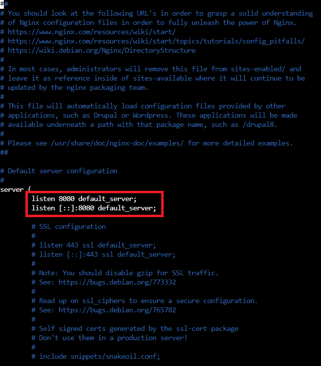

## Docker

- Create a docker file to install linux server with nginx.

  I created the Dockerfile below to build the first image with the default values for the NGINX.

  Using ubuntu as linux server and installing the NGINX
```
  FROM ubuntu:18.04
  RUN apt-get update -y 
  RUN apt-get install nginx -y
  RUN apt-get install curl -y 
  EXPOSE 80:80
  CMD ["/usr/sbin/nginx", "-g", "daemon off;"]

  $ docker build -t linux-nginx:888 .
```
- Change the default port to 8080.

  I created the container and login inside to get de **default file** (/etc/nginx/sites-available/) to change the default port

```
  
  $ docker run -it --name test-888  linux-nginx:888 /bin/bash
  
```

   I changed the default file on my folder to build a new image with the new default port
  
   
  

- Create an image out of it.

```
  FROM ubuntu:18.04
  RUN apt-get update -y 
  RUN apt-get install nginx -y
  RUN apt-get install curl -y 
  COPY default /etc/nginx/sites-available/
  RUN rm -f /etc/nginx/sites-enabled/* 
  RUN ln -s /etc/nginx/sites-available/default /etc/nginx/sites-enabled/
  EXPOSE 8080:8080
  CMD ["/usr/sbin/nginx", "-g", "daemon off;"]

  $ docker build -t linux-nginx-port:888 .
  $ docker run -d --name test-888-port -p 8080:8080 linux-nginx-port:888
```


- Upload your docker script to your Git repo
